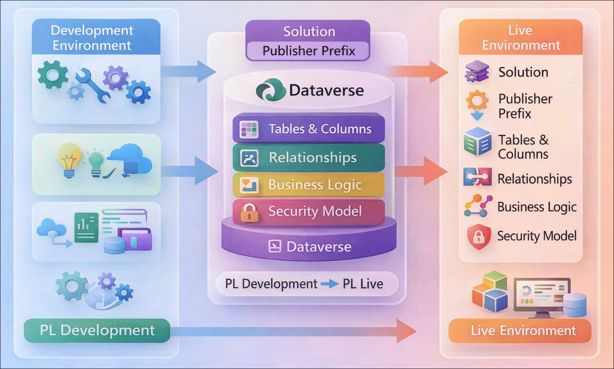

# Getting Started with Your PL-200 Power Platform Functional Consultant Workshop
 
Welcome to your PL-200 Power Platform Functional Consultant workshop! We've prepared a seamless environment that provides a hands-on platform with access to Power Platform tools, learning resources, practical exercises, and support for immersive learning. Let's begin by making the most of this experience:

### Overall Estimated Duration: 40 Hours

## Overview

In this hands-on lab series, you’ll gain practical experience in building and managing solutions using the Microsoft Power Platform. You’ll start by setting up environments, validating access, and configuring solutions with publishers and components. You’ll then work with Dataverse to design and customize tables, columns, and relationships, ensuring a strong data model.

Next, you’ll implement security through users, teams, and roles, and enhance functionality using forms, business rules, auditing, and duplicate detection. You’ll also manage data operations like import, bulk deletion, and validation.

Finally, you’ll package and deploy solutions across environments, gaining end-to-end experience in designing, customizing, securing, and deploying scalable business applications.

>**Note**:  Once you launch the track, you'll have access to a virtual machine (VM) with **40 hours of runtime**. Assuming you use the VM for **8 hours per day** and stop/deallocate it after each session, those 40 runtime hours will span approximately **4 days and 8 hours of elapsed time** (5 lab sessions). Please plan your lab sessions accordingly. If the 40 hours of VM runtime are exhausted before you complete the labs, access will be lost. To avoid this, stop or deallocate the VM from the **Resources** tab when you're finished for the day. Refer to the **[Managing Your Virtual Machine](#managing-your-virtual-machine)** section for step-by-step instructions.  

>  If the full 40 hours of VM uptime is exhausted, the VM will no longer be accessible, and **the lab duration cannot be extended**.

## Objectives

By the end of this lab series, you will be able to:

1. **Set up and manage Power Platform environments**: Create Development and Live environments, configure settings, and prepare a structured workspace for solution development and deployment.
2. **Create and manage solutions with publishers**: Build custom solutions, configure publishers, and organize components for efficient lifecycle management.
3. **Import solutions and data into Dataverse**: Load pre-built solutions and datasets using tools like Configuration Migration and dataflows.
4. **Design and customize Dataverse tables and columns**: Modify existing tables, create custom tables, and configure columns including choices, lookups, and auto-number fields.
5. **Define relationships and data modeling logic**: Create and manage relationships, implement hierarchical structures, and use calculated and rollup columns.
6. **Customize forms and model-driven apps**: Modify forms, add controls, and configure app components to enhance user experience.
7. **Implement security and access control**: Manage users, teams, security roles, and column-level security to control data access.
8. **Automate business logic and data validation**: Create business rules, enable auditing, and configure duplicate detection for data integrity.
9. **Manage data operations and maintenance**: Perform bulk deletion, monitor data changes, and maintain clean and efficient datasets.
10. **Package and deploy solutions across environments**: Export and import managed/unmanaged solutions to support application lifecycle management.

## Pre-requisites

* Basic understanding of **Microsoft Power Platform** concepts, including Power Apps and Microsoft Dataverse.
* Familiarity with model-driven apps, tables, columns, and relationships in Dataverse.
* Experience navigating the **Power Apps Maker portal** and **Power Platform admin center**.
* Access to a Microsoft 365 tenant with appropriate Power Platform licenses (e.g., Power Apps Developer).
* Basic knowledge of solution management, including environments, publishers, and components.
* Understanding of data concepts such as tables, records, relationships, and data validation.
* Familiarity with role-based security, including users, teams, and security roles.
* General understanding of application lifecycle management (ALM) concepts such as exporting and importing solutions.

## Architecture

The lab architecture demonstrates how a **Power Platform solution** is designed, customized, secured, and deployed using **Microsoft Dataverse**, Power Apps, and supporting services:

1. **Power Platform Environments (Development & Live)**: Separate environments used to build, test, and deploy solutions, supporting proper application lifecycle management.

2. **Microsoft Dataverse**: Acts as the central data platform, storing tables, columns, relationships, and business logic that power the applications.

3. **Solutions and Publisher**: Provide a structured container to manage and transport components such as tables, apps, flows, and security configurations across environments.

4. **Tables, Columns, and Relationships**: Define the data model, including custom tables, lookup relationships, calculated fields, and rollup columns to structure business data.

5. **Model-Driven Apps and Forms**: Deliver the user interface for interacting with data, where forms, views, and controls are customized to meet business requirements.

6. **Business Logic Layer**: Includes business rules, auditing, duplicate detection, and validation mechanisms to enforce data integrity and automate processes.

7. **Security Model**: Implements access control using users, teams, security roles, and column security profiles to ensure proper data access and governance.

8. **Data Integration and Management**: Uses tools like dataflows and migration utilities to import, update, and maintain data within Dataverse.

9. **Solution Deployment (ALM)**: Enables exporting and importing managed and unmanaged solutions to move customizations from Development to Live environments.

10. **User Interaction**: End users interact with model-driven apps to create, update, and manage records, while the platform enforces logic, security, and data consistency behind the scenes.

## Architecture Diagram

## Explanation of Components

1. **Power Platform Environments (Development & Live)**: Provide isolated workspaces for building, testing, and deploying solutions, ensuring a clear separation between development and production stages.

2. **Microsoft Dataverse**: Serves as the central data platform that stores business data, including tables, columns, relationships, and supports advanced features like auditing and security.

3. **Solutions and Publisher**: Act as containers to organize and manage components such as tables, apps, flows, and security roles, enabling easy transport of customizations across environments.

4. **Tables, Columns, and Relationships**: Define the core data model, including custom tables, various column types (choice, lookup, calculated, rollup), and relationships that structure how data is connected.

5. **Model-Driven Apps and Forms**: Provide the user interface for interacting with data, where forms, views, and controls are customized to deliver a tailored user experience.

6. **Business Logic Components**: Include business rules, duplicate detection, auditing, and validation mechanisms that enforce data integrity and automate processes without code.

7. **Security Model (Users, Teams, Roles)**: Controls access to data and functionality using role-based security, teams, and column-level security profiles to ensure proper governance.

8. **Data Integration and Management Tools**: Enable importing, transforming, and maintaining data using dataflows, migration tools, and bulk operations.

9. **Solution Deployment (ALM Process)**: Supports exporting and importing managed and unmanaged solutions to move configurations from Development to Live environments efficiently.

10. **User Interaction**: End users interact with model-driven apps to create, update, and manage records, while the platform handles logic, validation, and security in the background.

## Accessing Your Lab Environment
 
Once you're ready to dive in, your virtual machine and lab guide will be right at your fingertips within your web browser.
 

### Virtual Machine & Lab Guide
 
Your virtual machine is your workhorse throughout the workshop. The lab guide is your roadmap to success.
 
## Exploring Your Lab Resources
 
To get a better understanding of your lab resources and credentials, navigate to the **Environment** tab.
 

## Utilizing the Split Window Feature
 
For convenience, you can open the lab guide in a separate window by selecting the **Split Window** button from the Top right corner.
 

 
## Lab Duration Extension

1. To extend the duration of the lab, kindly click the **Hourglass** icon in the top right corner of the lab environment. 

        

    >**Note:** You will get the **Hourglass** icon when 10 minutes are remaining in the lab.

3. Click **OK** to extend your lab duration.
 
        

4. If you have not extended the duration prior to when the lab is about to end, a pop-up will appear, giving you the option to extend. Click **OK** to proceed.

## Lab Progress

You can use the **Progress** tab to track your progress while working on the lab. A score will be provided after successful validation.

## Managing Your Virtual Machine
 
Feel free to start, stop, or restart your virtual machine as needed from the **Resources** tab. Your experience is in your hands!
 

## Lab Guide Zoom In/Zoom Out
 
To adjust the zoom level for the environment page, click the **A↕: 100%** icon located next to the timer in the lab environment.

>**Note:**  The VM idleness tracker is enabled. If the virtual machine remains inactive for 45 minutes, a 10-minute warning message will appear. If no action is taken during this period, the VM will automatically shut down and deallocate after a total of 55 minutes of inactivity.

 
## Support Contact
 
The CloudLabs support team is available 24/7, 365 days a year, via email and live chat to ensure seamless assistance at any time. We offer dedicated support channels explicitly tailored for both learners and instructors, ensuring that all your needs are promptly and efficiently addressed.
 
Learner Support Contacts:
 
- Email Support: cloudlabs-support@spektrasystems.com
- Live Chat Support: https://cloudlabs.ai/labs-support

Click on **Next** from the lower right corner to move on to the next page.
 

 
## Happy Learning !!
